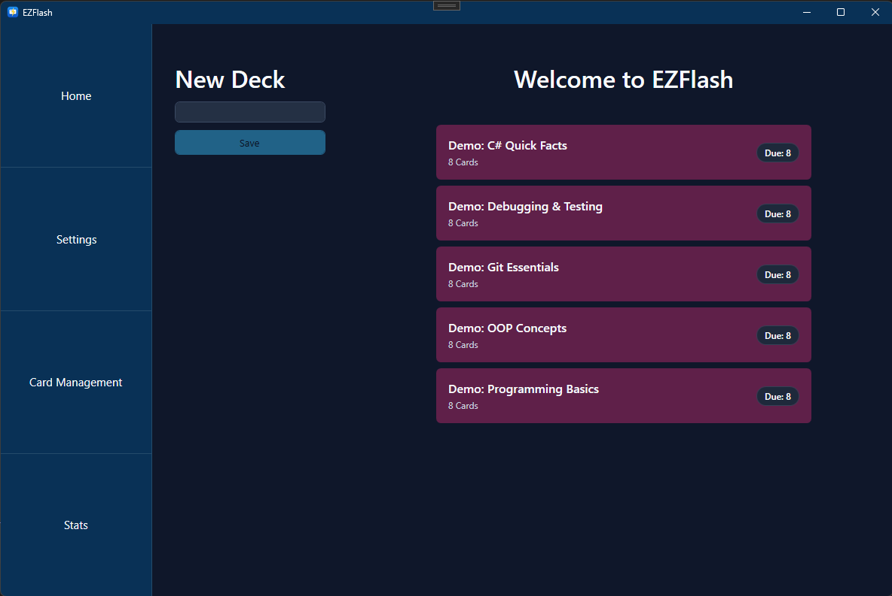
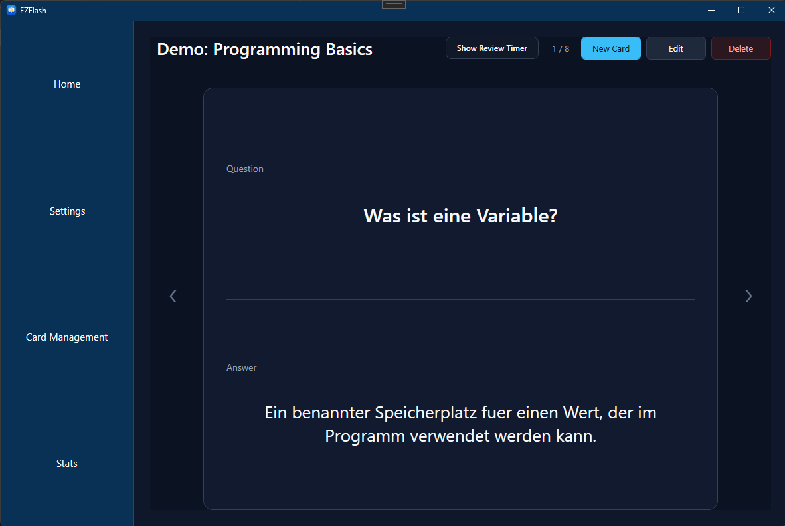
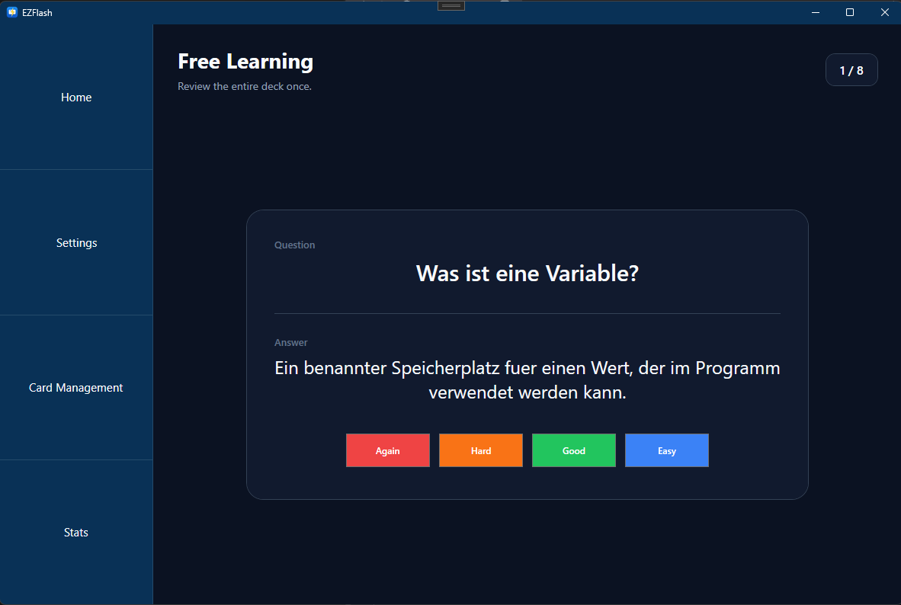

# EZFlash

EZFlash is a WPF desktop application for creating, managing, and reviewing flashcards. It supports deck-based learning, scheduled reviews, custom learning intervals, and a review log for completed study sessions.

## Screenshots

### Main Deck Overview


---
<br>

### Card Management

---
<br>

### Learning Mode

---
<br>

## Features

- Create and organize flashcard decks
- Add, edit, delete, and browse cards inside a selected deck
- Learn a whole deck in free learning mode
- Review only due cards in scheduled learning mode
- Rate answers with `Again`, `Hard`, `Good`, or `Easy`
- Configure learning intervals, start factors, multipliers, and streak weighting
- Save decks and settings locally as JSON files
- View previous review sessions in the review log

## Tech Stack

- C#
- .NET 8
- WPF
- MVVM-style structure with Views, ViewModels, Models, and Commands
- JSON-based local persistence

## Project Structure

```text
EZFlash/
├── Assets/          # App icon and UI icons
├── Commands/        # Relay command implementation
├── Models/          # Decks, cards, reviews, settings, learning logic
├── Resources/       # Shared WPF styles, colors, and layouts
├── ViewModels/      # UI state and commands
├── Views/           # WPF views
└── EZFlash.csproj   # .NET project file
```

## Getting Started

### Requirements

- Windows
- .NET 8 SDK

### Run the App

```bash
dotnet run
```

### Build the App

```bash
dotnet build
```

## Data Storage

EZFlash stores user data locally next to the application output:

- Decks are saved as JSON files in `decks/`
- Settings are saved in `settings.json`

These generated files are not required in the repository and are created automatically when the app runs.

## Learning Modes

### Free Learning

Free learning reviews every card in the selected deck once, independent of whether the cards are currently due.

### Scheduled Learning

Scheduled learning only shows cards whose next review date is due. Ratings update each card's interval and next review date.

If you use different filenames, update the image links in the `Screenshots` section.

## License

No license has been specified yet.
